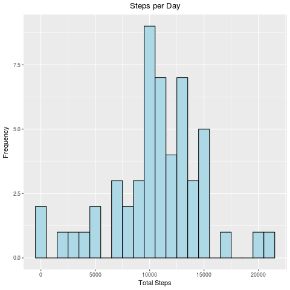

```{r setup, include=FALSE}
knitr::opts_chunk$set(echo = TRUE)
```
## Loading and preprocessing the data
The data used for this project can be downloaded from 
[Activity Data](https://d396qusza40orc.cloudfront.net/repdata%2Fdata%2Factivity.zip)

The data contains a header row. There are three columns: *steps*, *date*, *interval*.

1. **steps**: Number of steps taken in a 5-minute interval. Missing values are encoded as
NA.
2. **date**: The date on which the measurement was taken in YYYY-MM-DD format
3. **interval**: Identifier for the 5-minute interval in which measurement was taken

The dataset is stored in a comma-separated-value (CSV) file and there are a total of 17,568 observations in this dataset.

### Load the libraries that I'll be using:
1. **dplyr** for easier data manipulation
2. **lubridate** for date manipulations
3. **magrittr** for pipe operators
4. **knitr** for table generation with kable()
5. **ggplot2** for plotting

```
library(dplyr)
library(lubridate)
library(magrittr)
library(knitr)
library(ggplot2)
```

### Read in the data and take a look at the data.

```
activities <- read.csv(file = "activity.csv")
kable(activities %>% sample_n(10), align = "l", row.names = FALSE)
kable(strtable(activities))
```

**10 Sample Rows** below show data examples including the NA's for steps

|steps |date       |interval |
|:-----|:----------|:--------|
|36    |2012-10-10 |1755     |
|0     |2012-10-02 |1300     |
|NA    |2012-11-04 |1750     |
|0     |2012-11-07 |2025     |
|43    |2012-10-05 |725      |
|NA    |2012-10-01 |1325     |
|54    |2012-11-19 |645      |
|0     |2012-11-06 |955      |
|505   |2012-10-27 |830      |
|503   |2012-11-21 |755      |

Printing the classes shows that dates are currtently factors. These will be changed to date types.

|variable |class               |levels                          |examples            |
|:--------|:-------------------|:-------------------------------|:-------------------|
|steps    |integer             |NA                              |NA, NA, NA, NA, ... |
|date     |Factor w/ 61 levels |"2012-10-01", "2012-10-02", ... |"2012-10-01", ...   |
|interval |integer             |NA                              |0, 5, 10, 15, ...   |

### Convert the dates from factors to dates

```
activities %<>% mutate(date=ymd(date))
```

### Next I'll add the day of the week, using the abbreviations, as a new column
```
activities$weekday <- as.factor(weekdays(activities$date, abbreviate = TRUE))
```


## What is the mean total number of steps taken per day?

For this part of the assignment, you can ignore the missing values in the dataset.

1. Calculate the total number of steps taken per day
2. If you do not understand the difference between a histogram and a barplot, research the difference between them. Make a histogram of the total number of steps taken each day
3. Calculate and report the mean and median of the total number of steps taken per day

As the first step I'll remove the rows where steps = NA. Then I'll calculate the steps per day, the historgram
and the mean/median of the total number of steps taken per day. I thought that it might be interesting to calculate
the total steps per weekday so I calculated that as well.

```
activitiesNoNAs <- activities[complete.cases(activities),]
stepsPerWeekDay <- aggregate(activitiesNoNAs$steps, by = list(activitiesNoNAs$weekday), sum)
stepsPerDay <- aggregate(activitiesNoNAs$steps, by = list(activitiesNoNAs$date), sum)
names(stepsPerWeekDay) <- c("Weekday", "Steps")
names(stepsPerDay) <- c("Day", "Steps")
kable(stepsPerDay[order(stepsPerDay$Day),], align = "l", row.names = FALSE)
kable(stepsPerWeekDay[order(stepsPerWeekDay$Steps),], align = "l", row.names = FALSE)
```
Total steps per day omitting values where steps is NA:

|Day        |Steps |
|:----------|:-----|
|2012-10-02 |126   |
|2012-10-03 |11352 |
|2012-10-04 |12116 |
|2012-10-05 |13294 |
|2012-10-06 |15420 |
|2012-10-07 |11015 |
|2012-10-09 |12811 |
|2012-10-10 |9900  |
|2012-10-11 |10304 |
|2012-10-12 |17382 |
|2012-10-13 |12426 |
|2012-10-14 |15098 |
|2012-10-15 |10139 |
|2012-10-16 |15084 |
|2012-10-17 |13452 |
|2012-10-18 |10056 |
|2012-10-19 |11829 |
|2012-10-20 |10395 |
|2012-10-21 |8821  |
|2012-10-22 |13460 |
|2012-10-23 |8918  |
|2012-10-24 |8355  |
|2012-10-25 |2492  |
|2012-10-26 |6778  |
|2012-10-27 |10119 |
|2012-10-28 |11458 |
|2012-10-29 |5018  |
|2012-10-30 |9819  |
|2012-10-31 |15414 |
|2012-11-02 |10600 |
|2012-11-03 |10571 |
|2012-11-05 |10439 |
|2012-11-06 |8334  |
|2012-11-07 |12883 |
|2012-11-08 |3219  |
|2012-11-11 |12608 |
|2012-11-12 |10765 |
|2012-11-13 |7336  |
|2012-11-15 |41    |
|2012-11-16 |5441  |
|2012-11-17 |14339 |
|2012-11-18 |15110 |
|2012-11-19 |8841  |
|2012-11-20 |4472  |
|2012-11-21 |12787 |
|2012-11-22 |20427 |
|2012-11-23 |21194 |
|2012-11-24 |14478 |
|2012-11-25 |11834 |
|2012-11-26 |11162 |
|2012-11-27 |13646 |
|2012-11-28 |10183 |
|2012-11-29 |7047  |

In the following table, steps per weekday omitting values where is NA, we can see that the least steps per day 
are on Thursday and the most are on Wednesday.

|Weekday |Steps |
|:-------|:-----|
|Thu     |65702 |
|Mon     |69824 |
|Tue     |80546 |
|Sun     |85944 |
|Fri     |86518 |
|Sat     |87748 |
|Wed     |94326 |

### Histogram of the steps per day with binwidth = 1000

```
png(filename = "histogram_1.png", width = 480, height = 480, units = "px", pointsize = 12, bg="white")
qplot(stepsPerDay$Steps, binwidth = 1000, geom = "histogram", xlab = "Total Steps", 
    ylab = "Frequency", fill=I("lightblue"), col=I("black"), main ="Histogram of Steps per Day") +
    theme(plot.title = element_text(hjust = 0.5))
dev.off()
```



## What is the average daily activity pattern?


## Imputing missing values